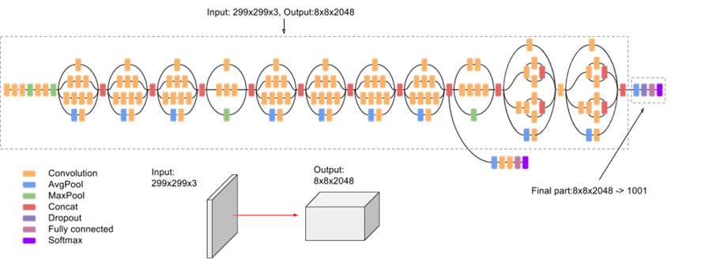
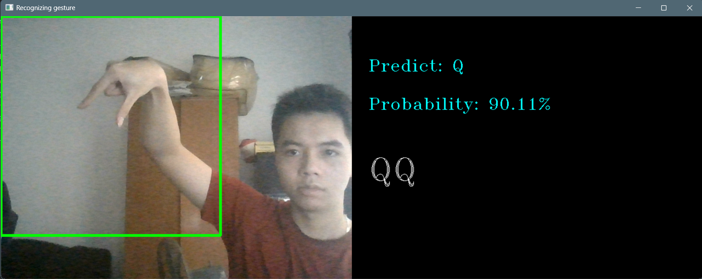

# Hệ thống nhận diện ngôn ngữ ký hiệu tay sử dụng học sâu

## Tổng quan
Dự án xây dựng hệ thống **nhận diện ngôn ngữ ký hiệu tay** dựa trên tập dữ liệu hình ảnh của bảng chữ cái **American Sign Language (ASL)**. Mô hình được huấn luyện để phân loại các cử chỉ tay tương ứng với các chữ cái trong bảng chữ cái.

Hệ thống bao gồm hai chức năng chính:
- Huấn luyện mô hình học sâu từ tập dữ liệu hình ảnh
- Nhận diện ký hiệu tay theo thời gian thực thông qua webcam

Mô hình được xây dựng bằng **TensorFlow** và sử dụng **Transfer Learning với InceptionV3**.

---

# Công nghệ sử dụng
- Python  
- TensorFlow / Keras  
- OpenCV (sử dụng cho nhận diện qua webcam)

---

# Bộ dữ liệu

Mô hình được huấn luyện trên bộ dữ liệu **ASL Alphabet** từ Kaggle:

https://www.kaggle.com/datasets/grassknoted/asl-alphabet

Trước khi huấn luyện, tải và giải nén bộ dữ liệu vào thư mục:

```
./data/
```

---

# Kiến trúc mô hình

Dự án sử dụng phương pháp **Transfer Learning với InceptionV3** để tận dụng các đặc trưng hình ảnh đã được học từ các tập dữ liệu lớn.

Các tầng convolution pretrained được sử dụng để trích xuất đặc trưng từ ảnh, sau đó thêm các tầng phân loại để dự đoán các chữ cái trong bộ dữ liệu ASL.



---

# Huấn luyện mô hình

## Bước 1: Cài đặt thư viện

Cài đặt các thư viện cần thiết bằng lệnh:

```
pip install -r requirements.txt
```

## Bước 2: Huấn luyện mô hình

Chạy script huấn luyện:

```
python src/train.py
```

Ngoài ra có thể chạy trực tiếp trên **Google Colab**.

---

# Nhận diện ký hiệu tay bằng webcam

Chương trình hỗ trợ nhận diện ký hiệu tay theo thời gian thực bằng webcam.

Chạy lệnh sau:

```
python app.py
```

Chương trình sẽ:
1. Lấy hình ảnh từ webcam
2. Xử lý khung hình
3. Dự đoán ký hiệu tay tương ứng bằng mô hình đã huấn luyện

---

# Kết quả

### Training Accuracy


### Fine-tune Accuracy


### Confusion Matrix


### Ví dụ dự đoán



---

# Tài liệu tham khảo

1. *Hands-On Machine Learning with Scikit-Learn, Keras, and TensorFlow (2nd Edition)*

2. **Going Deeper with Convolutions**  
https://arxiv.org/abs/1409.4842
